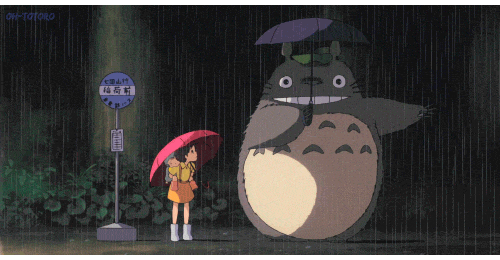

# hello-world
test it
https://github.com/Maphilius/hello-world.git
push -f 了

# TTfish

TTfish added some comments and fixed some defination as a developer in branch TTfish

</img>

Todo : 
> * get the operate function down 
> * make the code more resonable